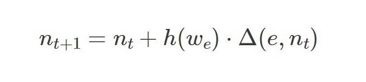
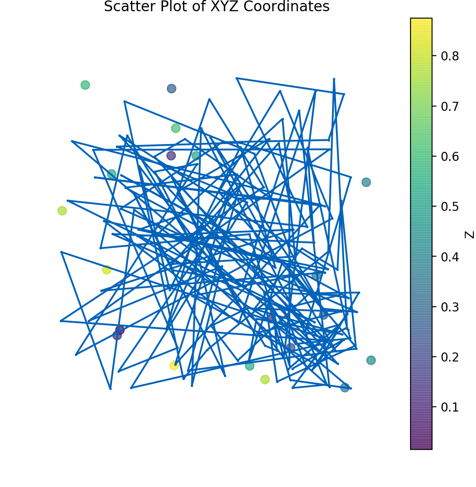
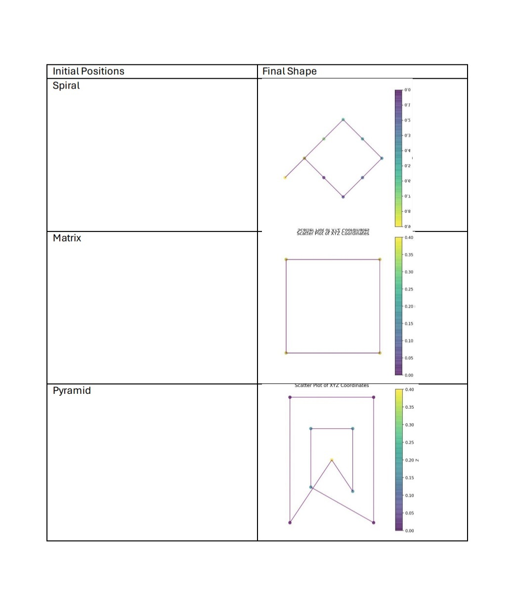

#som4drones
The idea presented in this article is an improvement involving memoization over a self-organizing map aka SOM which is a machine learning technique that reduces the dimensionality of a high-dimensional dataset. It's a type of artificial neural network (ANN) that uses unsupervised learning to produce a low-dimensional representation of a training sample's input space. This representation is known as a map. SOMs are unsupervised algorithms, such as k-means clustering and principal component analysis (PCA). SOMs have two stages: ordering and convergence. The algorithm has five stages: Initialization, Sampling, Matching, Updating, Continuation. 
The map is the representation in the reduced dimensions. The model is the real-world observation that the map is trying to represent. Initially it starts out with an approximation. All the vectors in the map start out with a uniform distribution across the sample space and listed in sorted order. Then their positions are refined with each epoch. Each position in the current epoch is evaluated based on every element e of the model by calculating the distance between the element and the node n in the previous epoch and weighted by the neighborhood factor of the winning neuron say we.
The expression used for this convergence is: 
  
With any distance measure, say Euclidean, the winner of an element is the most similar node in the map. The neighborhood is defined as a convolutional-like kernel for the map around the winner. This lets us update the winner and the neurons close by and iteratively attain an optimum fit. 
The starting point for the drone formation, represented with neurons, can be a grid or a circle. In the latter case, the SOM will behave like an elastic ring, getting closer to the stimuli while trying to minimize the perimeter Nodes that are similar to each other will tend to be closer to one another.
Self-organizing maps are pure classification with a uniform rate of converge across the whole sample space. Consequently, the overall convergence can take time or a lot more repetitions for highly skewed data where the real-world distribution of vectors in the vector space are highly irregular or concentrated in some space while being sparse in others. By drawing bounding boxes and measuring density in terms of the number of vectors within a bounding box, we divide the original vector space into numerous sub-spaces where different weighting factors and dimension reduction yield better solutions. Reuse of results from overlapping bounding boxes in various sub space calculations can be achieved by memoization if the vector space and the elements of the real world are always taken in the same reference system and order. With memoization, varying bounding boxes and adjustments to dimensionality based on the density of the vectors, a better match can be found between the map and the world than a non-varying SOM. This improvement requires simultaneous classification and regression as well as memoization of the results from the real-world sub-spaces. 
While SOM is applied to traveling salesman problem, an implementation is provided for 3D coordinates and drone formation.
Implementation of SOM only without varying convergence: https://github.com/raja0034/som4drones 
Sample Run:

Sample Convergence"

